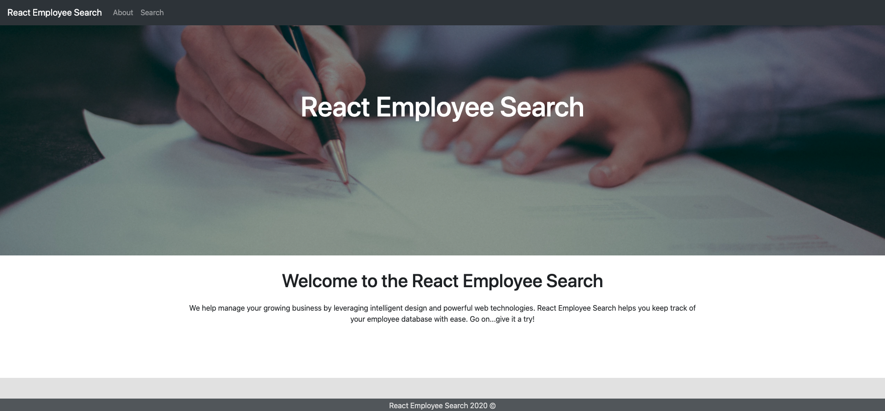
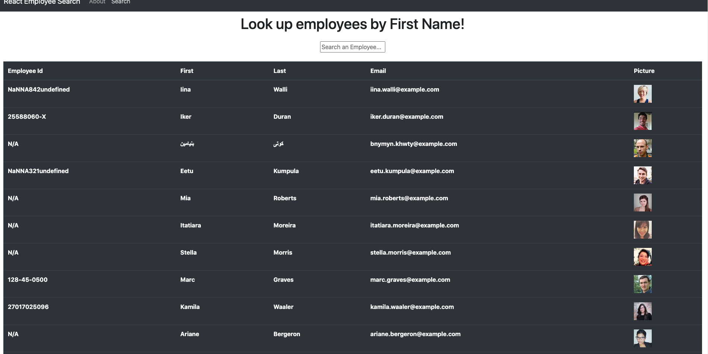
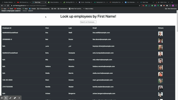

  

  # React Employee Search 
  
  ## Description
  This project uses React and React Router to allow users to navigate to a search page, which is then populated by axios search results from the _randomuser.me_ api. It uses class components to track state and dynamically render users to the page which can then be filtered dynamically via the search bar.

  ## Table of Contents
  * [Installation](#Installation)
  * [Usage](#Usage)
  * [Contributing](#Contributing)
  * [Tests](#Tests)
  * [License](#License)
  * [Questions](#Questions)
  
  ## Installation
  This website requires no installation. It can be visited at (ad-fleming.github.io/react-employee-directory)
  
  ## Usage
  Simply navigate to the search page and begin typing an Employee first name. An onChange event dynamically adapts the table based on the current input.

  ## Images and Demo

  ### Homepage
  
   
   
   
  
   
   
   
  

  ## License
  This project is covered under the MIT license.

  _You can learn more about this project's license <a href="https://choosealicense.com/licenses/mit/">here</a>_

  ## Links
  [Repository](https://github.com/ad-fleming/react-employee-directory)
   
  [Deployed Site](https://ad-fleming.github.io/react-employee-directory/)
  

  ## Questions
  If you have any questions, feel free to reach out to me at the following:
  * Email: adfleming9@gmail.com
  * GitHub: ad-fleming
